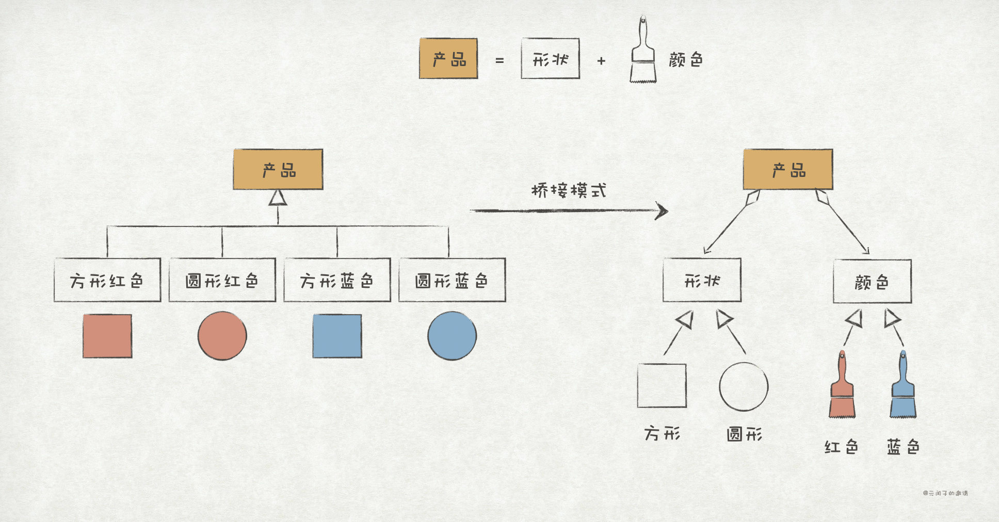
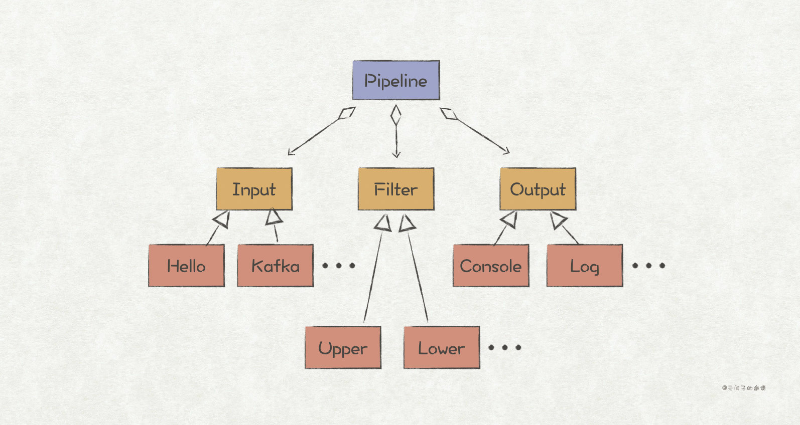

## 设计模式
- [快来，这里有23种设计模式的Go语言实现（一）](https://bbs.huaweicloud.com/blogs/279505)
- [快来，这里有23种设计模式的Go语言实现（二）](https://bbs.huaweicloud.com/blogs/280291)

## 创建型模式 (Creational Pattern)

#### 1、单例模式 (Singleton Pattern)
- 主要用于保证一个类仅有一个实例，并提供一个访问它的全局访问点
- go test -v ./msgpool/

#### 2、建造者模式 (Builder Pattern)
- 主要解决需要创建对象时需要传入多个参数，或者对初始化顺序有要求的场景
- go test -v ./msg/ 

#### 3、工厂模式 (Factory Method Pattern)
- 通过提供一个工厂对象或者工厂方法，为使用者隐藏了对象创建的细节
- go test -v ./event/

#### 4、抽象工厂模式 (Abstract Factory Pattern)
- 对工厂方法模式的优化，通过为工厂对象新增一个抽象层，让工厂对象遵循单一职责原则，也避免了霰弹式修改
- go test -v -run=TestPipeline ./pipeline/
- ./plugin/

#### 5、原型模式 (Prototype Pattern)
- 让对象复制更加简单
- go test -v ./prototype/

## 结构型模式 (Structural Pattern)

#### 6、组合模式 (Composite Pattern)
- 解决代码复用的问题，相比于继承关系，组合模式可以避免继承层次过深导致的代码复杂问题
- ./msg/ msg.Message{}
- ./pipeline pipeline.Pipeline{}
- 一个Pipeline由Input、Filter、Output三类插件组成，形成了“部分-整体”的关系，而且它们都实现了Plugin接口
- go test -v -run=TestPipeline ./pipeline

#### 7、适配器 (Adapter Pattern)
- 看作是两个不兼容接口之间的桥梁，可以将一个接口转换成Client所希望的另外一个接口，解决了模块之间因为接口不兼容而无法一起工作的问题
- ./msg/kafka
- ./pipeline pipeline.KafkaInput{}
- go test -v -run=TestKafkaInputPipeline ./pipeline

#### 8、桥接模式 (Bridge Pattern)
- 将模块的抽象部分和实现部分进行分离，让它们能够往各自的方向扩展，从而达到解耦的目的
- ./pipeline pipeline.Pipeline{}
- go test -v -run=TestPipeline ./pipeline

## 行为型模式 (Behavioral Pattern)

## 全部测试
- go test ./...
- go test -v ./...

## 6大原则

#### 开闭原则
- 对扩展开放，对修改关闭

#### 接口隔离原则
- 使用多个隔离的接口，比使用单个接口要好

#### 迪米特法则
- 一个实体应当尽量少的与其他实体之间发生相互作用，使得系统功能模块相对独立

#### 单一职责原则
- 应该有且只有一个原因引起类的变更。换句话说就是一个接口只做一件事，即一个职责一个接口

#### 里氏替换原则
- 任何基类可以出现的地方，子类一定可以出现

#### 依赖倒转原则
- 针对接口编程，依赖于抽象而不依赖于具体